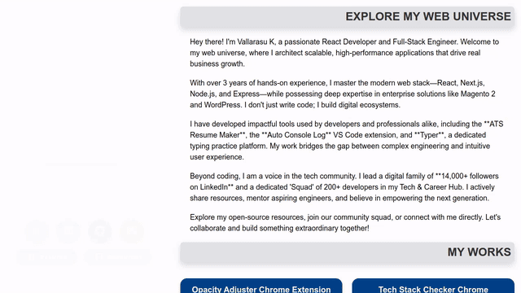

# Visual Dev Showcase

A curated collection of developer portfolios with live scrolling previews.

## Contact & Resources

- Portfolio: [vallarasuk.com](https://vallarasuk.com)
- Blog: [dev.vallarasuk.com](https://dev.vallarasuk.com)
- Live TV: [livetv.vallarasuk.com](https://livetv.vallarasuk.com)
- VS Code Extension: [Auto Console Log](https://marketplace.visualstudio.com/items?itemName=VallarasuKanthasamy.auto-console-log-by-vallarasu-kanthasamy)
- Resources: [vallarasuk.com/resources](https://vallarasuk.com/resources)
- ATS Resume Maker: [atsresumemaker.vallarasuk.com](https://atsresumemaker.vallarasuk.com)
- Place Finder: [placefinder.vallarasuk.com](https://placefinder.vallarasuk.com)
- Books: [books.vallarasuk.com](https://books.vallarasuk.com)
- Space: [space.vallarasuk.com](https://space.vallarasuk.com)
- VS Marketplace: [VallarasuKanthasamy](https://marketplace.visualstudio.com/publishers/VallarasuKanthasamy)
- WhatsApp Group: [Join Chat](https://chat.whatsapp.com/JzCFT47gI6aE8O6mJA96V0)
- Chrome Extension (Tech Stack): [Tech Stack Checker](https://chromewebstore.google.com/detail/tech-stack-checker/lhcplmfhkmjobfnndaabeddibhimghgf?hl=en)
- Chrome Extension (Opacity): [Opacity Adjuster](https://chromewebstore.google.com/detail/opacity-adjuster/elgajofcbjicopepiodbabodkajnihog?hl=en)
- Instagram: [@vallarasuk](http://insta.vallarasuk.com/)
- LinkedIn: [linkedin.vallarasuk.com](https://linkedin.vallarasuk.com)
- GitHub: [github.vallarasuk.com](https://github.com/vallarasuk)
- Community: [squad.vallarasuk.com](http://squad.vallarasuk.com/)
- Awesome Resources: [awesome-developer-resources](https://github.com/vallarasuk/awesome-developer-resources)

## Portfolios

| Developer | Preview | Portfolio URL |
| :--- | :---: | :--- |
| **Vallarasu Kanthasamy** |  | [vallarasuk.com](https://vallarasuk.com) |
